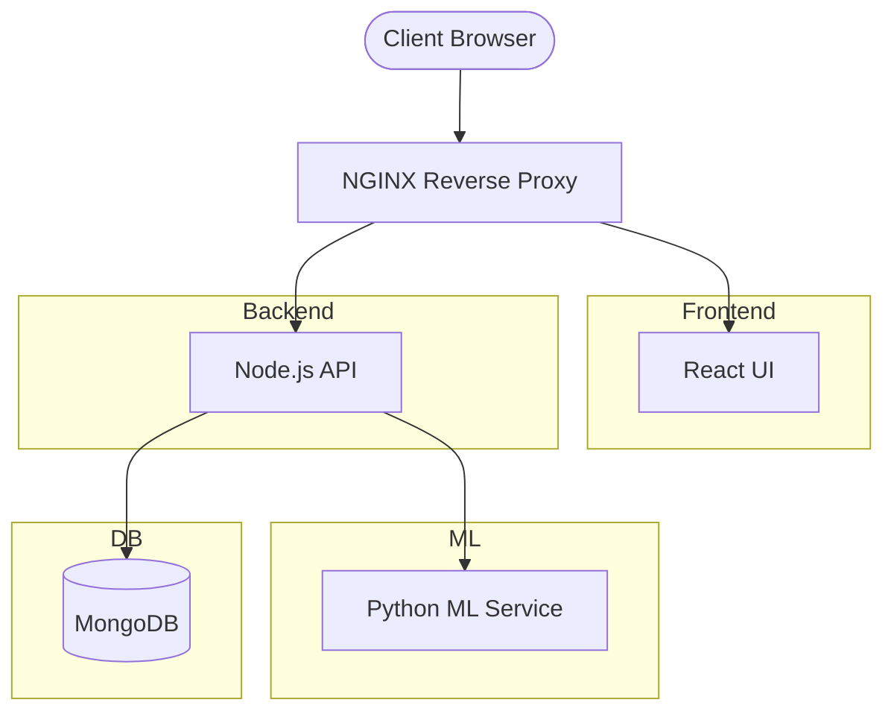
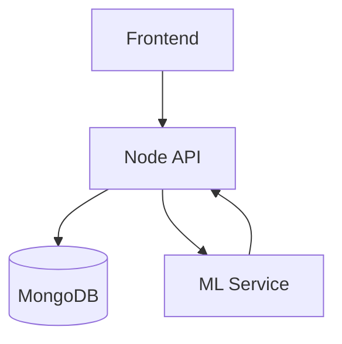

<div align="center">

<h1>🌍 FinSight AI - Intelligent Personal Finance Tracker</h1>
  <p><em>“Not just tracking money — understanding it.”</em></p>
  <p><strong>Experience the next generation of financial tracking with predictive ML insights, dynamic goal allocation, and real-time visualization.</strong></p>
  
  <p>
    <a href="#features"><strong>Features</strong></a> ·
    <a href="#architecture"><strong>Architecture</strong></a> ·
    <a href="#quick-start-docker"><strong>Quick Start</strong></a> ·
    <a href="#manual-setup"><strong>Manual Setup</strong></a>
  </p>
=======
  
  <h1>✨ FinSight-AI ✨</h1>
  <p>A next-generation, AI-powered Personal Finance Intelligence System designed to empower users with predictive analytics, transaction management, and intelligent goal tracking.</p>


  <!-- Badges -->
  <p>
    
    
    
    
    
  </p>

</div>

---

## 🌟 Overview

Welcome to **FinSight-AI**, a premier financial intelligence suite.
This project is built on a scalable microservice architecture bringing together a lightning-fast React frontend, a robust Node.js backend, and a dedicated Python Machine Learning service.

It is designed to:

* Track income and expenses
* Categorize transactions
* Deliver proactive financial insights

---

## 🚀 Key Features

* **AI Predictive Analytics** — Behavioral analysis and spending forecasts
* **Comprehensive Dashboard** — Interactive, glassmorphism UI
* **Intelligent Goal Tracking** — Dynamic savings allocation
* **Transaction Management** — Secure categorized transactions
* **Fully Containerized Environment** — Docker-based deployment

---

## 🛠️ Technology Stack

### Frontend Ecosystem (`Frontend/`)

* React (TypeScript)
* Context API + React Router
* Tailwind CSS

### Backend (`Backend/`)

* Node.js + Express
* MongoDB (Mongoose)
* JWT Authentication

### Machine Learning (`ML_Service/`)

* Python
* Predictive modeling pipelines

---

## 🏗️ Technical Architecture

FinSight AI follows a **containerized microservices architecture** ensuring scalability and separation of concerns.

### ⚙️ High-Level Diagram



---

### 🧩 Core Components

**1. Frontend (React + TypeScript)**

* Vite-based fast builds
* Tailwind UI
* Charts + dashboard

**2. Backend (Node.js + Express)**

* JWT authentication
* CRUD operations
* ML service integration

**3. ML Service (Python)**

* Predictive analytics
* Behavior insights

**4. Database (MongoDB)**

* Stores users, transactions, goals

**5. Docker Orchestration**

* Multi-container system
* NGINX routing

---

### 📂 Directory Structure

```text
FinSight-AI/
├── Backend/
│   ├── models/
│   ├── routes/
│   └── controllers/
├── Frontend/
│   ├── src/
│   │   ├── components/
│   │   ├── pages/
│   │   └── store/
├── ML_Service/
│   ├── app.py
│   └── predictor.py
├── docker-compose.yml
└── README.md
```

---

## 🏗️ System Architecture (Simplified)



---

## 📂 System Topology

```text
📦 FinSight-AI
 ┣ 📂 Frontend
 ┃ ┣ 📂 src/pages
 ┃ ┗ 📂 src/components
 ┣ 📂 Backend
 ┣ 📂 ML_Service
 ┗ 📜 docker-compose.yml
```

---

## 🚦 Getting Started (Docker Compose)

```bash
git clone https://github.com/shreyas-bhandari/FinSight-AI.git
cd FinSight-AI
docker-compose up -d --build
```

> Stop containers using: `docker-compose down`

---

<div align="center">
  <b>🚀 Architected for next-generation financial intelligence</b>
</div>
