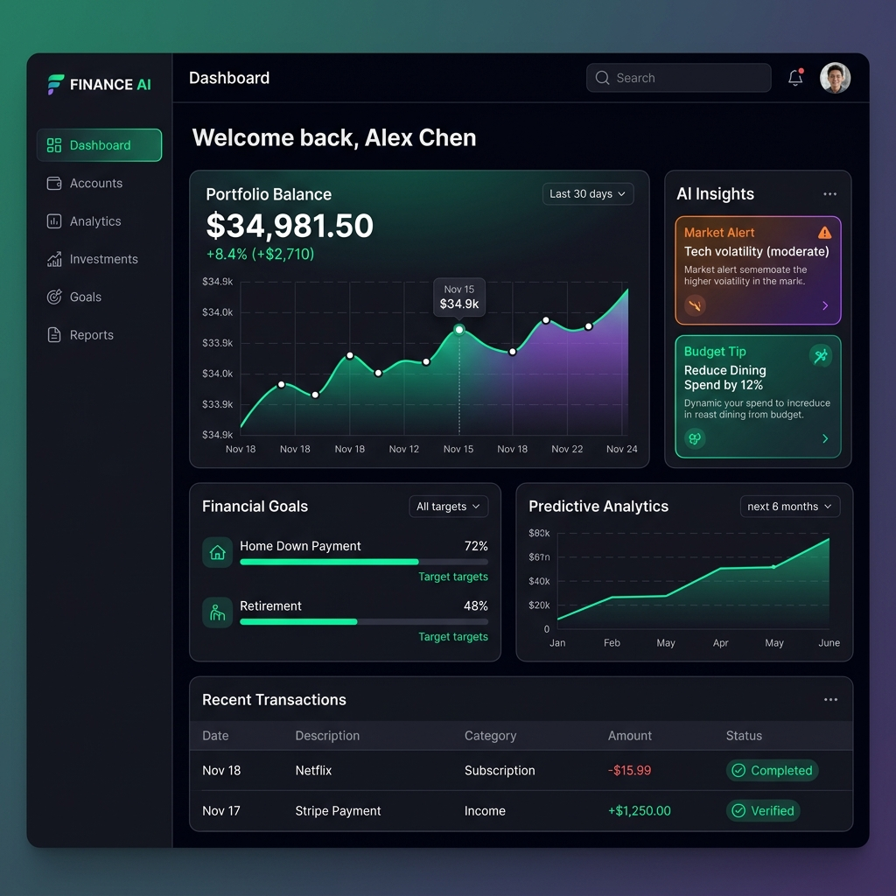
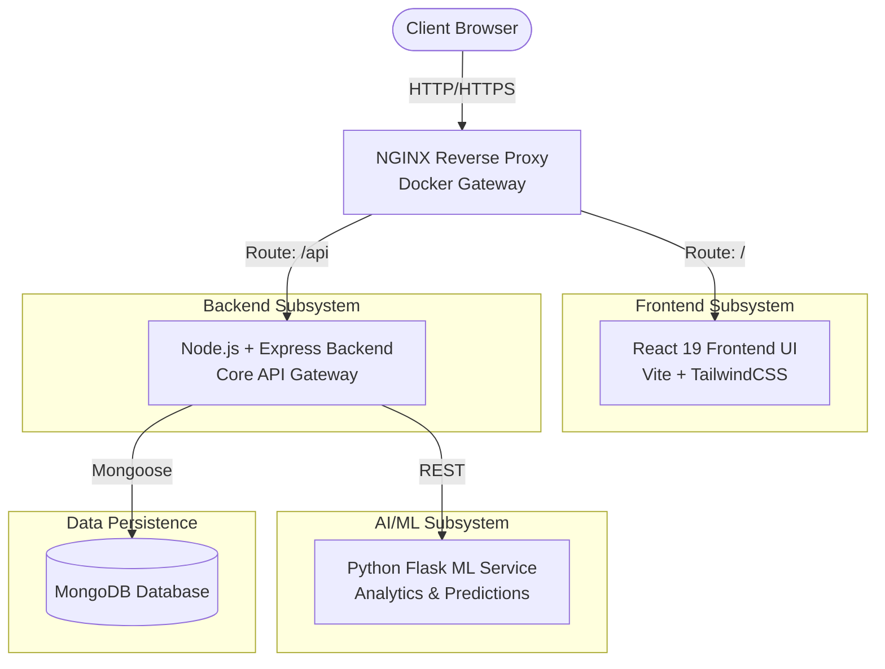
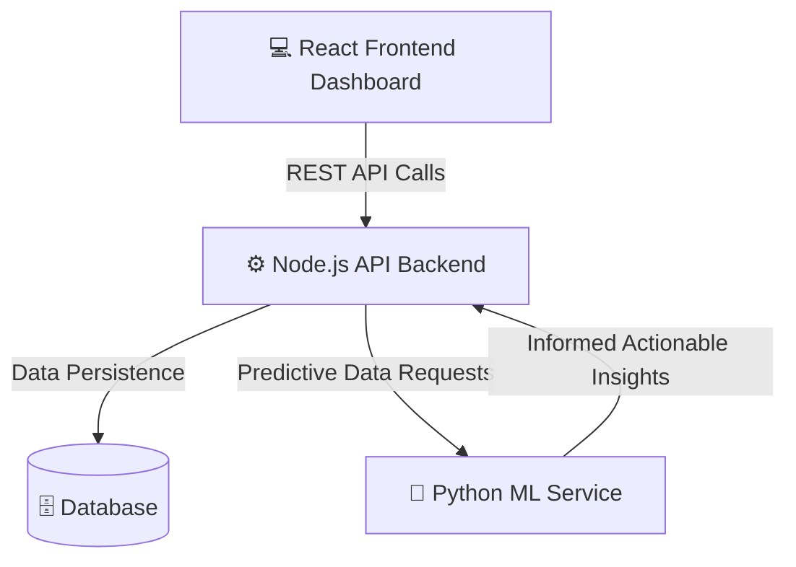

<div align="center">

  <h1>🌍 FinSight AI - Intelligent Personal Finance Tracker</h1>
  <p><em>“Not just tracking money — understanding it.”</em></p>
  <p><strong>Experience the next generation of financial tracking with predictive ML insights, dynamic goal allocation, and real-time visualization.</strong></p>
  
  <p>
    <a href="#features"><strong>Features</strong></a> ·
    <a href="#architecture"><strong>Architecture</strong></a> ·
    <a href="#quick-start-docker"><strong>Quick Start</strong></a> ·
    <a href="#manual-setup"><strong>Manual Setup</strong></a>
  </p>
=======
  
  <h1>✨ FinSight-AI ✨</h1>
  <p>A next-generation, AI-powered Personal Finance Intelligence System designed to empower users with predictive analytics, transaction management, and intelligent goal tracking.</p>
>>>>>>> 6486ea85262fbe4713f6dafacac1a499616a758d

  <!-- Badges -->
  <p>
    
    
    
    
    
  </p>

  
</div>

---

## 🌟 Overview

Welcome to **FinSight-AI**, a premier financial intelligence suite. This project is built on a scalable microservice architecture bringing together a lightning-fast React frontend, a robust Node.js backend, and a dedicated Python Machine Learning service. It is designed to track income, categorize expenses seamlessly, and deliver proactive financial insights based on user behavior patterns.

## 🚀 Key Features

* **AI Predictive Analytics:** A dedicated Python microservice driving behavioral analysis and spending forecasts.
* **Comprehensive Dashboard:** An interactive, dark-mode glassmorphism UI built for deep financial visualization.
* **Intelligent Goal Tracking:** Priority-based savings allocation and dynamic goal adjustment models.
* **Transaction Management:** Seamless logging, deep categorization, and secure RESTful transaction handlers.
* **Fully Containerized Environment:** Effortless deployment using Docker and orchestrating multiple distinct services.

---

## 🛠️ Technology Stack

An enterprise-grade selection of technologies architected for performance and data science capabilities:

### Frontend Ecosystem (`Frontend/`)
* **Framework:** React in TypeScript
* **State & Routing:** Context APIs & React Router
* **Styling:** Tailwind CSS with deep glassmorphism UI aesthetics

### Core API Server (`Backend/`)
* **Runtime:** Node.js + Express
* **Database Management:** Deeply structured MongoDB interactions
* **Security:** Secured JWT Authentication mechanisms

### Machine Learning Hub (`ML_Service/`)
* **Environment:** Python
* **Capabilities:** Predictive analytics and predictive modeling pipelines

---

<<<<<<< HEAD
## 🏗️ Technical Architecture

FinSight AI is designed using a modern, containerized microservices architecture to ensure scalability, separation of concerns, and robust performance. 

### ⚙️ High-Level Diagram


### 🧩 Core Components

1. **Frontend UI (React 19 + TypeScript)**
   - **Framework:** Vite for blazing-fast HMR and optimized builds.
   - **Styling:** TailwindCSS for utility-first styling and a responsive UI system.
   - **Data Flow:** Dynamic state management combined with Axios for declarative API fetching.
   - **Role:** Handles user authentication flows, dynamic charts (`recharts`), and rich dashboards.

2. **Backend API (Node.js + Express.js)**
   - **Architecture:** Controller-Service-Model pattern for maintainable business logic.
   - **Authentication:** JWT (JSON Web Tokens) with `bcryptjs` password hashing.
   - **Role:** Acts as the central CRUD hub for transactions, goals, and user profiles. Invokes the ML service internally for generating smart insights.

3. **Machine Learning Microservice (Python + Flask)**
   - **Framework:** Lightweight Flask server for serving predictions via REST.
   - **Environment:** Isolated Python environment to handle data science packages.
   - **Role:** Receives sanitized transaction data from the Node API, processes trend analysis, calculates priority-based algorithmic goal distribution, and returns JSON insights.

4. **Database Layer (MongoDB)**
   - **Schema Design:** Mongoose ORM models enforcing strict relational schemas across Users, Transactions, and Savings Goals.
   - **Deployment:** Containerized single-node Mongo instance in development environments, fully compatible with MongoDB Atlas for production.

5. **Deployment & Orchestration (Docker)**
   - **Role:** Docker Compose manages multi-container application scaling.
   - **Reverse Proxy:** NGINX handles port mappings and maps external gateway requests directly to the correct internal container without exposing microservices to the public internet directly.

### 📂 Directory Structure

```text
FinSight-AI/
├── 📁 Backend/               # Node.js + Express API services
│   ├── models/             # Mongoose schemas (User, Transaction)
│   ├── routes/             # Express API endpoints
│   └── controllers/        # Business logic & ML invocations
├── 📁 Frontend/              # React 19 + TypeScript UI
│   ├── src/
│   │   ├── components/     # Reusable UI elements (charts, tables)
│   │   ├── pages/          # Dashboards and auth pages
│   │   └── store/          # React State Management
├── 📁 ML_Service/            # Python Flask microservice
│   ├── app.py              # ML REST endpoints
│   └── predictor.py        # Trend forecasting logic
├── 🐳 docker-compose.yml     # Multi-container orchestration
└── 📄 README.md              # Project documentation
```
=======
## 🏗️ System Architecture
>>>>>>> 6486ea85262fbe4713f6dafacac1a499616a758d



---

## 📂 System Topology

```text
📦 FinSight-AI
 ┣ 📂 Frontend            # Client Application (React/TS)
 ┃ ┣ 📂 src/pages         # Dashboard, Goals, Insights, Transactions
 ┃ ┗ 📂 src/components    # Reusable UI Blocks
 ┣ 📂 Backend             # Core Data Flow and Authentication API
 ┣ 📂 ML_Service          # Python-based Predictive Analytics Engine
 ┗ 📜 docker-compose.yml  # Orchestrates full stack deployment
```

---

## 🚦 Getting Started (Docker Compose)

Spinning up this microservices suite is completely automated via Docker:

```bash
# Clone the repository
git clone https://github.com/shreyas-bhandari/FinSight-AI.git

# Navigate into the project directory
cd FinSight-AI

# Boot up the Frontend, Backend, ML Service, and Database containers
docker-compose up -d --build
```
> **Note:** The frontend application will map to your host environment effortlessly. Stop the suite via `docker-compose down`.

---

<div align="center">
  <b>Architected for the future of decentralized algorithmic finance.</b>
</div>
