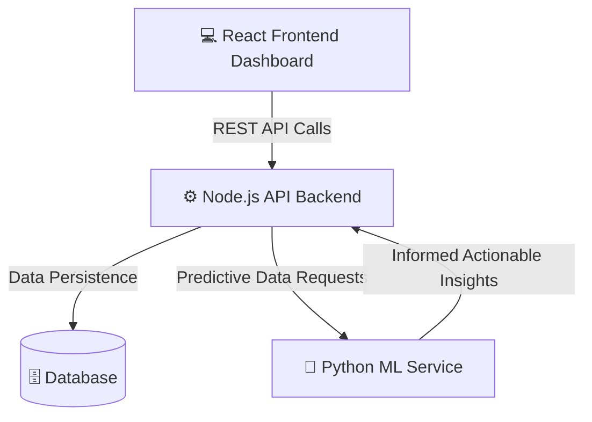

<div align="center">
  
  <h1>✨ FinSight-AI ✨</h1>
  <p>A next-generation, AI-powered Personal Finance Intelligence System designed to empower users with predictive analytics, transaction management, and intelligent goal tracking.</p>

  <!-- Badges -->
  <p>
    
    
    
    
    
  </p>
</div>

---

## 🌟 Overview

Welcome to **FinSight-AI**, a premier financial intelligence suite. This project is built on a scalable microservice architecture bringing together a lightning-fast React frontend, a robust Node.js backend, and a dedicated Python Machine Learning service. It is designed to track income, categorize expenses seamlessly, and deliver proactive financial insights based on user behavior patterns.

## 🚀 Key Features

* **AI Predictive Analytics:** A dedicated Python microservice driving behavioral analysis and spending forecasts.
* **Comprehensive Dashboard:** An interactive, dark-mode glassmorphism UI built for deep financial visualization.
* **Intelligent Goal Tracking:** Priority-based savings allocation and dynamic goal adjustment models.
* **Transaction Management:** Seamless logging, deep categorization, and secure RESTful transaction handlers.
* **Fully Containerized Environment:** Effortless deployment using Docker and orchestrating multiple distinct services.

---

## 🛠️ Technology Stack

An enterprise-grade selection of technologies architected for performance and data science capabilities:

### Frontend Ecosystem (`Frontend/`)
* **Framework:** React in TypeScript
* **State & Routing:** Context APIs & React Router
* **Styling:** Tailwind CSS with deep glassmorphism UI aesthetics

### Core API Server (`Backend/`)
* **Runtime:** Node.js + Express
* **Database Management:** Deeply structured MongoDB interactions
* **Security:** Secured JWT Authentication mechanisms

### Machine Learning Hub (`ML_Service/`)
* **Environment:** Python
* **Capabilities:** Predictive analytics and predictive modeling pipelines

---

## 🏗️ System Architecture



---

## 📂 System Topology

```text
📦 FinSight-AI
 ┣ 📂 Frontend            # Client Application (React/TS)
 ┃ ┣ 📂 src/pages         # Dashboard, Goals, Insights, Transactions
 ┃ ┗ 📂 src/components    # Reusable UI Blocks
 ┣ 📂 Backend             # Core Data Flow and Authentication API
 ┣ 📂 ML_Service          # Python-based Predictive Analytics Engine
 ┗ 📜 docker-compose.yml  # Orchestrates full stack deployment
```

---

## 🚦 Getting Started (Docker Compose)

Spinning up this microservices suite is completely automated via Docker:

```bash
# Clone the repository
git clone https://github.com/shreyas-bhandari/FinSight-AI.git

# Navigate into the project directory
cd FinSight-AI

# Boot up the Frontend, Backend, ML Service, and Database containers
docker-compose up -d --build
```
> **Note:** The frontend application will map to your host environment effortlessly. Stop the suite via `docker-compose down`.

---

<div align="center">
  <b>Architected for the future of decentralized algorithmic finance.</b>
</div>
