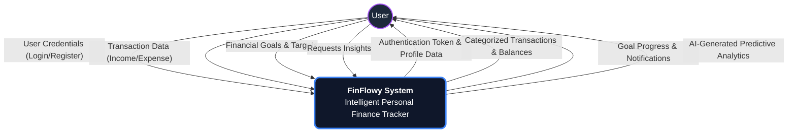
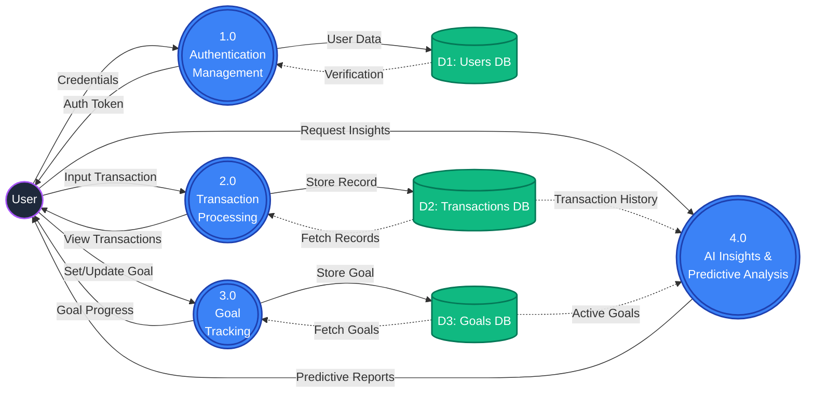
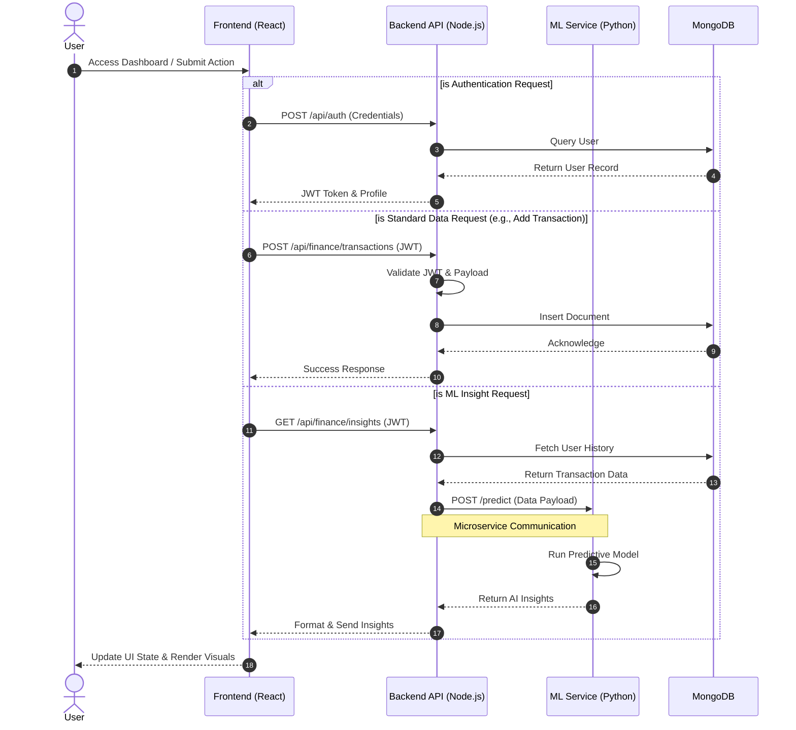

<div align="center">

<h1>🌍 FinFlowy - Intelligent Personal FinFlowy</h1>
  <p><em>“Not just tracking money — understanding it.”</em></p>
  <p><strong>Experience the next generation of financial tracking with predictive ML insights, dynamic goal allocation, and real-time visualization.</strong></p>
  
  <p>
    <a href="#features"><strong>Features</strong></a> ·
    <a href="#architecture"><strong>Architecture</strong></a> ·
    <a href="#quick-start-docker"><strong>Quick Start</strong></a> ·
    <a href="#manual-setup"><strong>Manual Setup</strong></a>
  </p>
=======
  
  <h1>✨ FinFlowy ✨</h1>
  <p>A next-generation, AI-powered Personal Finance Intelligence System designed to empower users with predictive analytics, transaction management, and intelligent goal tracking.</p>


  <!-- Badges -->
  <p>
    
    
    
    
    
  </p>

</div>

---

## 🌟 Overview

Welcome to **FinFlowy**, a premier financial intelligence suite.
This project is built on a scalable microservice architecture bringing together a lightning-fast React frontend, a robust Node.js backend, and a dedicated Python Machine Learning service.

It is designed to:

* Track income and expenses
* Categorize transactions
* Deliver proactive financial insights

---

## 🚀 Key Features

* **AI Predictive Analytics** — Behavioral analysis and spending forecasts
* **Comprehensive Dashboard** — Interactive, glassmorphism UI
* **Intelligent Goal Tracking** — Dynamic savings allocation
* **Transaction Management** — Secure categorized transactions
* **Fully Containerized Environment** — Docker-based deployment

---

## 🛠️ Technology Stack & Libraries

### 💻 Frontend Ecosystem
* **Framework:** React 18 with TypeScript
* **State Management:** Zustand / React Context API
* **Routing:** React Router DOM
* **Styling & UI:** Tailwind CSS, Framer Motion (Animations), Lucide React (Icons)
* **Build Tool:** Vite

### ⚙️ Backend Architecture
* **Runtime:** Node.js
* **Framework:** Express.js
* **Database:** MongoDB with Mongoose ODM
* **Security:** JWT Authentication, Bcrypt (Password Hashing), CORS, Helmet

### 🧠 Machine Learning & Data Science
* **Language:** Python 3.10+
* **Framework:** FastAPI
* **Data Processing:** Pandas, NumPy
* **Machine Learning:** Scikit-Learn (Predictive Modeling, Clustering)

---

## 🤖 Machine Learning Models

FinFlowy leverages advanced Machine Learning algorithms to provide proactive financial intelligence:
1. **Spending Categorization Model:** An NLP-based classifier that automatically assigns tags to new transactions based on historical patterns.
2. **Predictive Forecasting:** Time-series forecasting (e.g., ARIMA or Prophet) to estimate future end-of-month balances and upcoming expenses.
3. **Behavioral Anomaly Detection:** Isolation Forests to identify unusual spending behavior and alert the user immediately.

---

## 🏗️ Detailed System Diagrams

FinFlowy follows a **containerized microservices architecture** ensuring scalability and separation of concerns.

### 1️⃣ Context Diagram (DFD Level 0)

Provides a high-level view of the entire FinFlowy system and how it interacts with external entities (Users).



---

### 2️⃣ Data Flow Diagram (DFD Level 1)

Breaks down the main system into distinct sub-processes and shows the flow of data between these processes and the MongoDB data stores.



---

### 3️⃣ Control Flow Diagram (CFD)

Illustrates the logical sequence of operations and execution paths, focusing on the microservice routing between the Node.js API and the Python ML Service.



---

## 📂 System Topology

```text
📦 FinFlowy
 ┣ 📂 Frontend
 ┃ ┣ 📂 src/pages
 ┃ ┗ 📂 src/components
 ┣ 📂 Backend
 ┣ 📂 ML_Service
 ┗ 📜 docker-compose.yml
```

---

## 🚦 Getting Started (Docker Compose)

```bash
git clone https://github.com/shreyas-bhandari/FinFlowy.git
cd FinFlowy
docker-compose up -d --build
```

> Stop containers using: `docker-compose down`

---

<div align="center">
  <b>🚀 Architected for next-generation financial intelligence</b>
</div>
