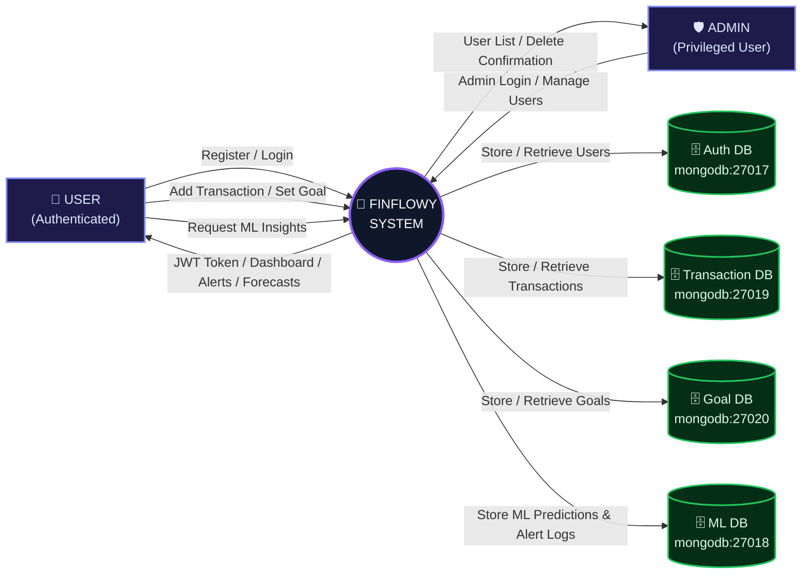
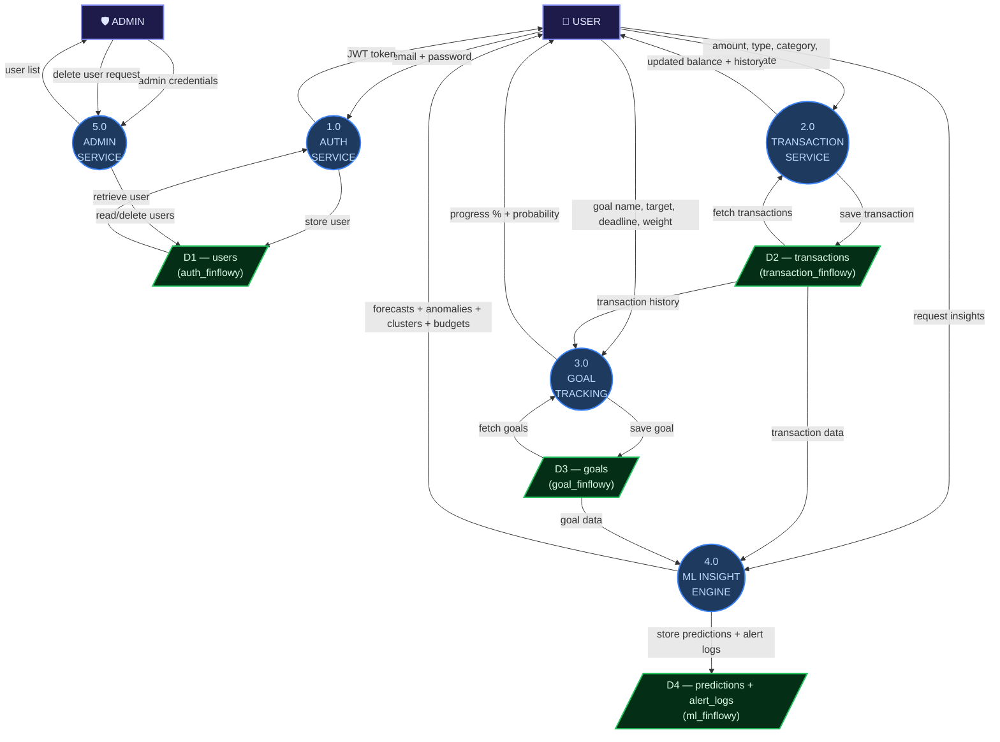
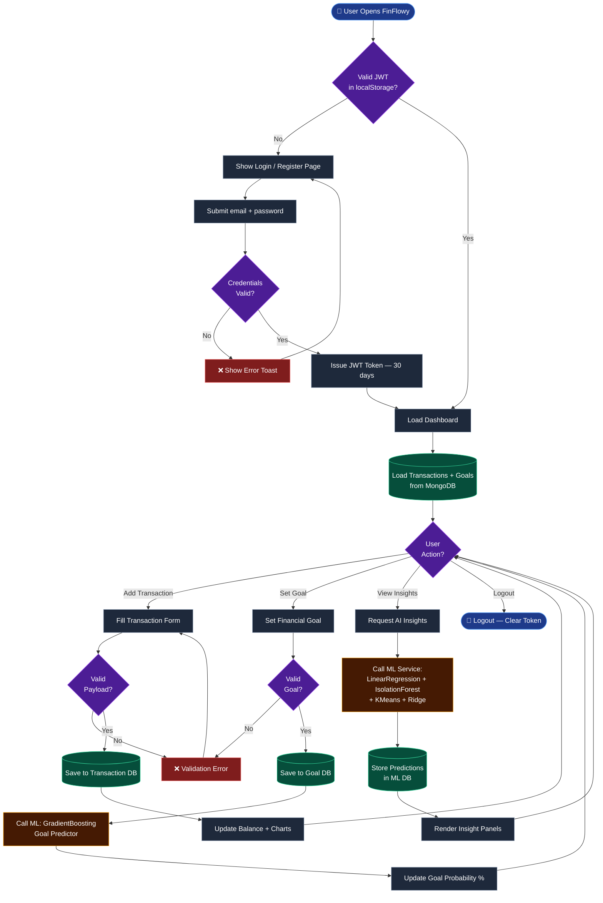

<div align="center">


<h3>🧠 Intelligent Personal Finance Intelligence System</h3>
<p><em>"Not just tracking money — understanding it."</em></p>

<p>
  
  
  
  
  
  
  
</p>

<p>
  <a href="#-overview"><strong>Overview</strong></a> ·
  <a href="#-key-features"><strong>Features</strong></a> ·
  <a href="#-system-architecture"><strong>Architecture</strong></a> ·
  <a href="#-ml-models"><strong>ML Models</strong></a> ·
  <a href="#-diagrams"><strong>Diagrams</strong></a> ·
  <a href="#-quick-start"><strong>Quick Start</strong></a> ·
  <a href="#-api-reference"><strong>API</strong></a>
</p>

</div>

---

## 📖 Overview

**FinFlowy** is a full-stack, AI-powered personal finance management platform built as a final year engineering project. It goes far beyond simple transaction tracking — it applies **real Machine Learning models** to your financial data to predict future expenses, detect anomalous spending, cluster your habits, and recommend intelligent budgets.

Built on a **Database-per-Service microservice architecture**, FinFlowy separates every domain (auth, transactions, goals, ML) into isolated services, making it production-ready, scalable, and maintainable.

| 🎯 Project Type | Final Year B.E. / B.Tech Project |
|---|---|
| 🏛️ Architecture | Microservices (Database-per-Service) |
| 🧠 Intelligence | 5 Real scikit-learn ML Models |
| 🐳 Deployment | Fully Dockerized (8 containers) |
| 🌐 Access | Web Browser — `http://localhost` |

---

## ✨ Key Features

### 💳 Transaction Management
- Add income and expense transactions with category, date, description
- Real-time balance, savings rate, and cash flow calculations
- Delete transactions with optimistic UI updates
- Persistent storage in isolated MongoDB instance

### 📊 Interactive Dashboard
- Live **Cash Flow Line Chart** (Income vs Expense over time)
- **Spending by Category Pie Chart** with colour-coded legend
- 4 KPI stat cards: Total Balance, Income, Expense, Savings Rate
- Last 5 recent transactions with type indicators

### 🎯 Goal Tracking
- Set financial goals with target amount, deadline, priority weight
- **GradientBoosting ML model** predicts achievement probability (%)
- Priority-based automatic income allocation (15% pool split by weight)
- Progress bars and actionable ML recommendations per goal

### 🤖 AI Insights Page
- **Expense Forecast** — next month's predicted spending
- **Anomaly Detection** — flagged unusual transactions
- **Spending Cluster Map** — KMeans-grouped spending habits
- **Budget Recommendations** — Ridge Regression per category
- All panels have graceful loading skeletons and fallback states

### 🔐 Authentication & Security
- JWT-based login/register with 30-day token expiry
- bcrypt password hashing (salt rounds: 10)
- Startup token validator — auto-clears stale/malformed/expired tokens
- Protected routes (user) + Admin-only routes
- CORS configured for cross-origin safety

### 🛡️ Admin Panel
- View all registered users in a table
- Role badges (Admin / User)
- Delete non-admin users with one click
- Access restricted to `isAdmin: true` users only

---

## 🏗️ System Architecture

FinFlowy uses a **Database-per-Service** microservice pattern. Each service owns its data and communicates through well-defined APIs. Nginx acts as the single entry point, routing all traffic.

```
┌─────────────────────────────────────────────────────────────────┐
│                     Browser (http://localhost)                   │
└─────────────────────────┬───────────────────────────────────────┘
                          │ Port 80
┌─────────────────────────▼───────────────────────────────────────┐
│                   Nginx Reverse Proxy                           │
│          /api/** → backend-api:5000                             │
│          /*      → React SPA (static files)                     │
└──────────┬──────────────────────────────────────────────────────┘
           │
┌──────────▼──────────────────────────────────────────────────────┐
│              Node.js Express Backend  (Port 5000)               │
│  Routes: /api/auth  |  /api/finance                             │
│  Middleware: JWT protect, CORS, JSON parser                     │
└──┬──────────┬────────────┬──────────────────┬───────────────────┘
   │          │            │                  │
   ▼          ▼            ▼                  ▼
Auth DB   Trans DB      Goal DB         ML Service
MongoDB   MongoDB       MongoDB       FastAPI Python
:27017    :27019        :27020           Port 5001
                                            │
                                         ML DB
                                        MongoDB
                                         :27018
```

### 🐳 Docker Services (8 Containers)

| Container | Image | Port | Purpose |
|-----------|-------|------|---------|
| `frontend-ui` | nginx:alpine | 80 | React SPA + Reverse Proxy |
| `backend-api` | node:22-alpine | 5000 | Express REST API |
| `ml-service` | python:3.11-slim | 5001 | FastAPI ML Engine |
| `mongodb-auth` | mongo:latest | 27017 | Users Database |
| `mongodb-transaction` | mongo:latest | 27019 | Transactions Database |
| `mongodb-goal` | mongo:latest | 27020 | Goals Database |
| `mongodb-ml` | mongo:latest | 27018 | ML Predictions & Alerts |

---

## 🧠 ML Models

FinFlowy implements **5 genuine scikit-learn Machine Learning models** — no rule-based heuristics, no fake randomness. Each model is trained on the user's own real financial data on every request.

### Model 1 — Linear Regression: Expense Forecaster
- **Purpose:** Predict next month's total expense
- **Features:** Month index (1, 2, 3…) → monthly expense totals
- **Output:** `predictedExpense`, `trend` (increasing/stable/decreasing), `confidence`, R² score
- **Endpoint:** `POST /api/ml/predict-expense`

### Model 2 — Isolation Forest: Anomaly Detection
- **Purpose:** Flag statistically unusual transactions
- **Features:** `[amount, category_encoded]` per expense
- **Contamination:** Adaptive (3–15% based on data size)
- **Output:** List of flagged transactions with anomaly scores + severity
- **Endpoint:** `POST /api/ml/behavior-analysis`

### Model 3 — Gradient Boosting Regressor: Goal Predictor
- **Purpose:** Predict probability (%) of achieving a financial goal
- **Features:** progress ratio, savings rate, expense ratio, feasibility ratio, months remaining, net cash ratio
- **Training:** Synthetic representative financial scenarios (20 samples)
- **Output:** `probability`, `monthlySavingsNeeded`, `recommendations[]`
- **Endpoint:** `POST /api/ml/goal-prediction`

### Model 4 — KMeans Clustering: Spending Patterns
- **Purpose:** Group spending categories into behaviour clusters
- **Features:** `[total_amount, transaction_count, avg_amount]` per category
- **Clusters:** Up to 3 — 🔴 High Spend / 🟡 Moderate / 🟢 Low Spend
- **Output:** Cluster map with labels, categories, totals
- **Endpoint:** `POST /api/ml/spending-patterns`

### Model 5 — Ridge Regression: Budget Recommender
- **Purpose:** Recommend optimal monthly budget per spending category
- **Features:** Monthly spend history per category (time series)
- **Guardrail:** 50/30/20 rule cap — max 25% of income per category
- **Output:** `recommendedBudget`, `potentialSaving`, confidence per category
- **Endpoint:** `POST /api/ml/budget-recommendation`

---

## 📐 Diagrams

### 1️⃣ Context Flow Diagram (CFD) — Level 0

The CFD shows the system as a single process and all external entities interacting with it.



---

### 2️⃣ Data Flow Diagram (DFD) — Level 1

Breaks the system into its core sub-processes and shows data movement between each process and data store.



---

### 3️⃣ Control Flow Diagram — System Logic

Shows the complete execution path from app launch through every user action.



---

## 📂 Project Structure

```
📦 FinFlowy/
├── 📁 Frontend/                    # React 18 + TypeScript + Vite
│   ├── 📁 src/
│   │   ├── 📁 pages/               # Dashboard, Transactions, Insights, Goals, Profile, Admin, Login, Register
│   │   ├── 📁 components/
│   │   │   ├── 📁 ui/              # Card, Button, Input, Label (custom design system)
│   │   │   └── 📁 layout/          # Layout, Navbar, Sidebar
│   │   ├── 📁 store/               # Zustand: useAuthStore, useFinanceStore
│   │   ├── 📁 services/            # api.ts (axios + interceptors), mlService.ts
│   │   └── 📁 lib/                 # utils.ts
│   ├── 📄 nginx.conf               # Reverse proxy config for Docker
│   ├── 📄 Dockerfile               # Multi-stage: Node build → Nginx serve
│   └── 📄 vite.config.ts
│
├── 📁 Backend/                     # Node.js + Express.js REST API
│   ├── 📁 config/
│   │   └── 📄 db.js                # 3 isolated Mongoose connections
│   ├── 📁 controllers/
│   │   ├── 📄 authController.js    # Register, Login, Profile, Admin CRUD
│   │   └── 📄 financeController.js # Transactions, Goals, ML proxy calls
│   ├── 📁 middleware/
│   │   └── 📄 authMiddleware.js    # JWT protect + admin guard
│   ├── 📁 models/
│   │   ├── 📄 User.js              # authDB model
│   │   ├── 📄 Transaction.js       # transactionDB model
│   │   └── 📄 Goal.js              # goalDB model
│   ├── 📁 routes/
│   │   ├── 📄 authRoutes.js
│   │   └── 📄 financeRoutes.js
│   ├── 📄 server.js
│   └── 📄 Dockerfile
│
├── 📁 ML_Service/                  # Python FastAPI + scikit-learn
│   ├── 📄 main.py                  # 5 ML model endpoints
│   ├── 📄 requirements.txt
│   └── 📄 Dockerfile
│
├── 📄 docker-compose.yml           # 8-container orchestration
├── 📄 .env                         # Environment variables
└── 📄 README.md
```

---

## 🗃️ Database Schema

### DB 1 — `auth_finflowy` (Port 27017)
```
users collection:
  _id         ObjectId
  name        String (required)
  email       String (required, unique)
  password    String (bcrypt hashed)
  isAdmin     Boolean (default: false)
  avatar      String (optional)
  createdAt   Date
  updatedAt   Date
```

### DB 2 — `transaction_finflowy` (Port 27019)
```
transactions collection:
  _id          ObjectId
  user         ObjectId (ref: User._id via JWT)
  amount       Number (required)
  type         String (enum: 'income' | 'expense')
  category     String (required)
  date         Date (required)
  description  String
  createdAt    Date
```

### DB 3 — `goal_finflowy` (Port 27020)
```
goals collection:
  _id            ObjectId
  user           ObjectId
  name           String (required)
  targetAmount   Number (required)
  currentAmount  Number (default: 0)
  probability    Number (ML-updated, default: 0)
  deadline       Date (required)
  priorityWeight Number (default: 50)
  createdAt      Date
```

### DB 4 — `ml_finflowy` (Port 27018)
```
alert_logs collection:
  userId, type, message, severity, model, createdAt

predictions collection:
  userId, type, predictedExpense, trend, r2Score, model, createdAt
```

---

## 🌐 API Reference

### Auth Endpoints

| Method | Endpoint | Access | Description |
|--------|----------|--------|-------------|
| POST | `/api/auth/register` | Public | Register new user |
| POST | `/api/auth/login` | Public | Login, returns JWT |
| GET | `/api/auth/profile` | Private | Get current user profile |
| GET | `/api/auth/users` | Admin | Get all users |
| DELETE | `/api/auth/users/:id` | Admin | Delete a user |

### Finance Endpoints

| Method | Endpoint | Access | Description |
|--------|----------|--------|-------------|
| GET | `/api/finance/transactions` | Private | Get all user transactions |
| POST | `/api/finance/transactions` | Private | Create a transaction |
| DELETE | `/api/finance/transactions/:id` | Private | Delete a transaction |
| GET | `/api/finance/goals` | Private | Get all user goals |
| POST | `/api/finance/goals` | Private | Create a goal |
| GET | `/api/finance/insights` | Private | Anomaly detection (IsolationForest) |
| GET | `/api/finance/insights/forecast` | Private | Expense forecast (LinearRegression) |
| GET | `/api/finance/insights/spending-patterns` | Private | Clusters (KMeans) |
| GET | `/api/finance/insights/budget-recommendation` | Private | Budgets (Ridge) |
| GET | `/api/finance/goals/:id/predict` | Private | Goal probability (GradientBoosting) |

### ML Service Endpoints (Internal — via Backend proxy)

| Method | Endpoint | ML Model |
|--------|----------|----------|
| POST | `/api/ml/predict-expense` | LinearRegression |
| POST | `/api/ml/behavior-analysis` | IsolationForest |
| POST | `/api/ml/goal-prediction` | GradientBoostingRegressor |
| POST | `/api/ml/spending-patterns` | KMeans |
| POST | `/api/ml/budget-recommendation` | Ridge Regression |

---

## 🚀 Quick Start

### Prerequisites
- [Docker Desktop](https://www.docker.com/products/docker-desktop/) installed and running
- Git

### Run with Docker (Recommended)

```bash
# 1. Clone the repository
git clone https://github.com/shreyas-bhandari/FinFlowy.git
cd FinFlowy

# 2. Start all 8 services
docker compose up -d --build

# 3. Open in browser
http://localhost
```

> ⏱️ First build takes ~3–5 minutes (downloads Docker images). Subsequent starts take ~10 seconds.

### Stop the Application
```bash
docker compose down
```

### View Logs
```bash
docker logs backend-api -f       # Backend logs
docker logs ml-service -f        # ML service logs
docker logs frontend-ui -f       # Nginx access logs
```

---

## 🔐 Default Credentials

| Role | Email | Password |
|------|-------|----------|
| **Regular User** | `xyz@gmail.com` | `789456` |
| **Admin** | `xyz@gmail.com` | `789456` (isAdmin promoted) |

> Admin panel: `http://localhost/admin`

---

## ⚙️ Environment Variables

```env
# Backend API
PORT=5000
NODE_ENV=development

# Database-per-Service URIs (Docker internal)
AUTH_DB_URI=mongodb://mongodb-auth:27017/auth_finflowy
TRANSACTION_DB_URI=mongodb://mongodb-transaction:27017/transaction_finflowy
GOAL_DB_URI=mongodb://mongodb-goal:27017/goal_finflowy
MONGO_URI=mongodb://mongodb-ml:27017/ml_finflowy

# Security
JWT_SECRET=finflowy_super_secret_jwt_2026

# ML Service
ML_API_URL=http://ml-service:5001/api/ml
```

---

## 🛠️ Technology Stack

### Frontend
| Technology | Version | Purpose |
|-----------|---------|---------|
| React | 18 | UI framework |
| TypeScript | 5 | Type safety |
| Vite | 8 | Build tool |
| Tailwind CSS | 4 | Styling |
| Zustand | 5 | State management |
| React Router DOM | 6 | Client-side routing |
| Recharts | 2 | Data visualizations |
| Framer Motion | 11 | Animations |
| React Hook Form | 7 | Form handling |
| Axios | 1.6 | HTTP client |
| Lucide React | — | Icon library |

### Backend
| Technology | Version | Purpose |
|-----------|---------|---------|
| Node.js | 22 | Runtime |
| Express.js | 4 | REST framework |
| Mongoose | 8 | MongoDB ODM |
| JSON Web Token | 9 | Authentication |
| bcryptjs | 3 | Password hashing |
| Axios | 1.6 | ML service calls |
| dotenv | 16 | Environment config |
| CORS | 2.8 | Cross-origin headers |

### ML Service
| Technology | Version | Purpose |
|-----------|---------|---------|
| Python | 3.11 | Runtime |
| FastAPI | 0.104 | REST framework |
| scikit-learn | 1.3.2 | ML models |
| Pandas | 2.1.3 | Data processing |
| NumPy | 1.26.2 | Numerical computing |
| PyMongo | 4.6.1 | MongoDB client |
| Uvicorn | 0.24 | ASGI server |

---

## 🔄 How It Works — End to End

```
1. User opens http://localhost
   → Nginx serves React SPA from /usr/share/nginx/html

2. User logs in (POST /api/auth/login via Nginx proxy)
   → Express verifies password with bcrypt
   → Signs JWT (30d expiry) with JWT_SECRET
   → Stores in browser localStorage

3. User adds a transaction
   → React calls POST /api/finance/transactions (Bearer JWT)
   → Express authMiddleware verifies JWT
   → Mongoose saves to transaction_finflowy DB

4. User views Insights
   → React calls GET /api/finance/insights/forecast
   → Express fetches ALL user transactions from DB
   → Express POSTs them to FastAPI ML service
   → FastAPI trains LinearRegression on the fly
   → Returns prediction → Express → React renders chart

5. Goal probability update
   → Express fetches goal + transactions
   → POSTs to FastAPI /api/ml/goal-prediction
   → GradientBoosting predicts % → stored back in Goal DB
```

---

## 📊 ML Pipeline Detail

```
User Transaction Data
        │
        ▼
  FastAPI receives JSON payload
        │
        ▼
  Pandas DataFrame construction
        │
        ├──► LinearRegression  ──► Next Month Expense
        ├──► IsolationForest   ──► Anomaly Scores
        ├──► KMeans            ──► Spending Clusters
        ├──► Ridge Regression  ──► Budget per Category
        └──► GradientBoosting  ──► Goal Achievement %
                │
                ▼
        Results stored in ml_finflowy MongoDB
                │
                ▼
        JSON response → Node.js → React UI
```

---

## 👥 Contributing

This is a final year academic project. For suggestions or improvements, feel free to open an issue or pull request.

---

<div align="center">

**Built with ❤️**

*FinFlowy — Where Machine Learning meets Personal Finance*

⭐ Star this repo if you found it helpful!

</div>
